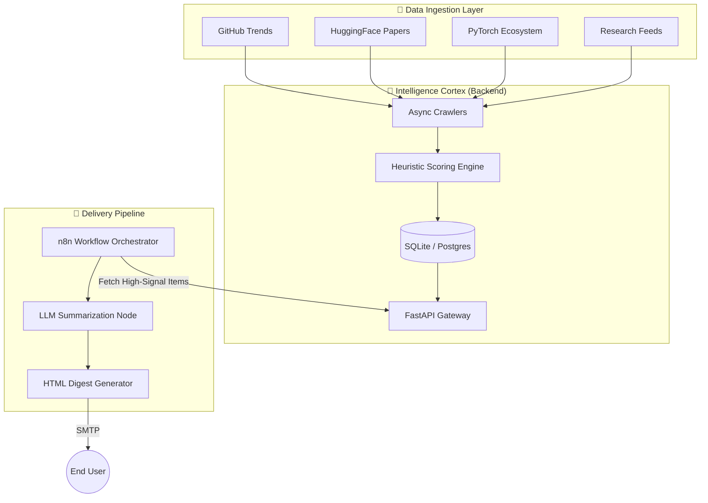

<div align="center">

# ⚡ DevPulse AI
### Automated Tech Intelligence Architecture

[](https://fastapi.tiangolo.com/)
[](https://www.docker.com/)
[](https://n8n.io/)
[](https://www.python.org/)
[](LICENSE)

<p align="center">
  <b>Automated Signal Extraction • Multi-Source Ingestion • AI-Ready Digests</b><br>
  <i>"Stop drinking from the firehose. Start analyzing the stream."</i>
</p>

</div>

---

## � The Mission
**DevPulse** is a high-velocity intelligence engine designed to solve the **Information Overload Paradox** facing modern engineers and researchers. 

In an ecosystem where hundreds of papers, repositories, and releases drop daily, manual tracking is inefficient. **DevPulse** operates as an autonomous background daemon, scraping, ranking, and synthesizing high-signal updates into a single, structured daily briefing.

## 🏗️ System Architecture

DevPulse employs a microservices-based crawling and scoring mesh. The system is decoupled into an ingestion layer (FastAPI), a processing layer (Scoring Engine), and a presentation layer (n8n/Email).



## 🧠 Core Systems

### 1. The Ingestion Mesh (Backend)
Built on **FastAPI**, the backend acts as the central nervous system.
- **Async Collectors**: Concurrent workers scrape targeted data sources (GitHub, HF, etc.) without blocking the main event loop.
- **Normalization**: Diverse data formats (JSON, RSS, HTML) are normalized into a unified `Item` schema.
- **Resilience**: Implements retry logic and error bounding for external APIs.

### 2. Heuristic Scoring Engine
Data is meaningless without prioritization. DevPulse implements a custom ranking algorithm:
- **Velocity Tracking**: Measures "stars per hour" or "fork velocity" for GitHub repos.
- **Impact Weighting**: Up-ranks major version releases (e.g., `v2.0` > `v2.0.1`).
- **Keyword Resonance**: Boosts items matching "LLM", "Agent", "Transformer" (configurable).

### 3. Orchestration & Delivery (n8n)
We utilize **n8n** for flexible, low-code workflow orchestration:
- **Decoupled Logic**: The backend provides raw data; n8n handles the "business logic" of presentation.
- **AI Integration**: Plug-and-play nodes for Gemini/OpenAI to generate executive summaries of the day's data.
- **HTML Injection**: Generates clean, mobile-responsive email layouts dynamically.

## �️ Tech Stack Specifications

| Component | Technology | Role |
|-----------|------------|------|
| **Core Service** | Python 3.10+, FastAPI | API, Data Processing, Scheduling |
| **Server** | Uvicorn (ASGI) | High-performance async server |
| **Persistence** | SQLite / Postgres (SQLAlchemy) | Relational storage of tech items |
| **Networking** | HTTPX | Non-blocking external requests |
| **Orchestrator** | n8n (Dockerized) | Workflow automation & email delivery |
| **Infrastructure** | Docker Compose | Service definition & networking |

## � Deployment Sequence

Deploying DevPulse is designed to be a "zero-friction" operation.

### Prerequisites
- Docker Engine & Docker Compose
- *Optional:* OpenAI/Gemini API Key (for summaries)

### Installation

1.  **Clone the Repository**
    ```bash
    git clone https://github.com/yourusername/devpulse-ai.git
    cd devpulse-ai
    ```

2.  **Initialize Environment**
    ```bash
    cp .env.example .env
    # Edit .env to configure your scraper targets and API keys
    ```

3.  **Ignite Services**
    ```bash
    docker compose up -d --build
    ```

    > **Status Report:**  
    > 🟢 Backend: `http://localhost:8000`  
    > 🟢 n8n Workflow: `http://localhost:5678`

## 🕹️ API & Usage

The backend exposes a clean REST interface. You can integrate DevPulse into your own dashboards.

**Identify Top 10 High-Signal Items:**
```bash
curl "http://localhost:8000/digest/json?limit=10&threshold=0.8"
```

**Force Trigger Crawl (Admin):**
```bash
curl -X POST "http://localhost:8000/admin/crawl"
```

## 🔭 Future Horizons

DevPulse is evolving from **Passive Collection** to **Active Agentic Analysis**.

- [ ] **Vector Database Integration**: Store embeddings of Readmes/Papers for semantic search.
- [ ] **Agentic Research**: "DevPulse, find me all new transformer architectures released this week."
- [ ] **Personalized Filtering**: Per-user interest graphs (e.g., "Only Computer Vision").

---

<div align="center">

**[View Implementation Plan](implementation_plan.md)** • **[Report Bug](issues)**

Designed with ❤️ for the Builders.
</div>
